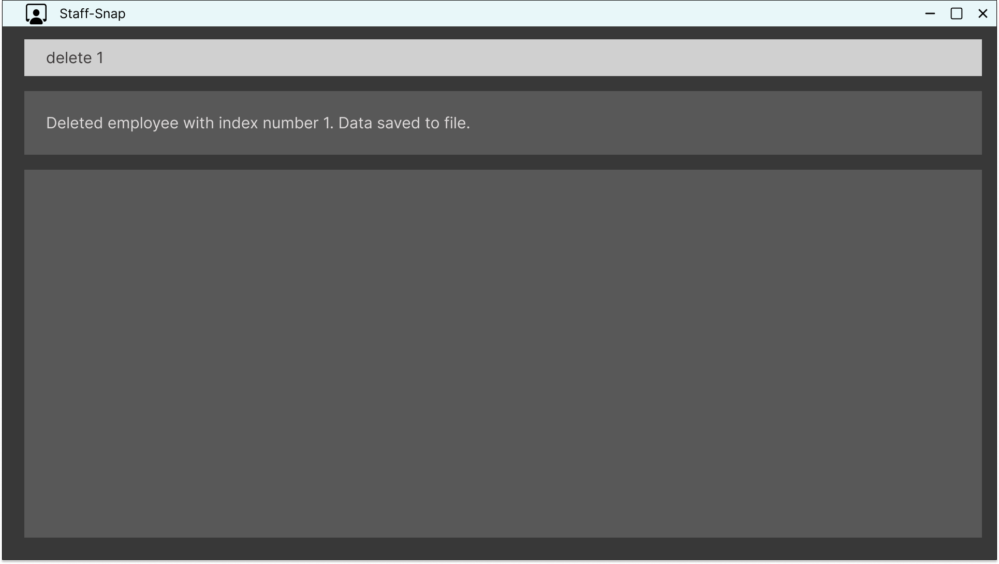
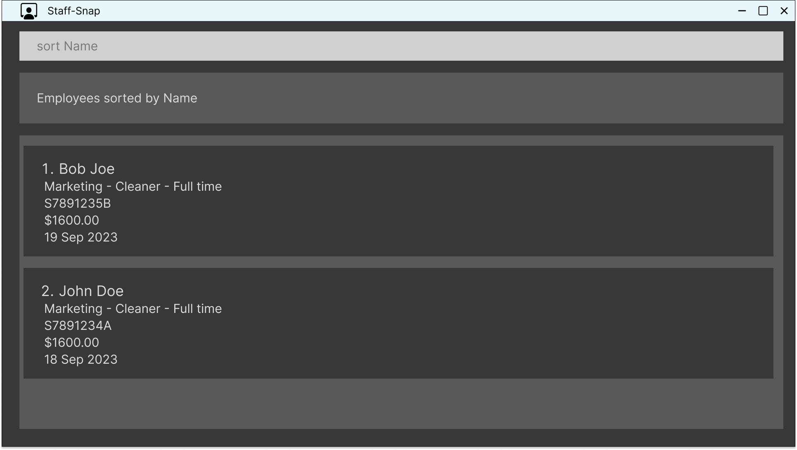
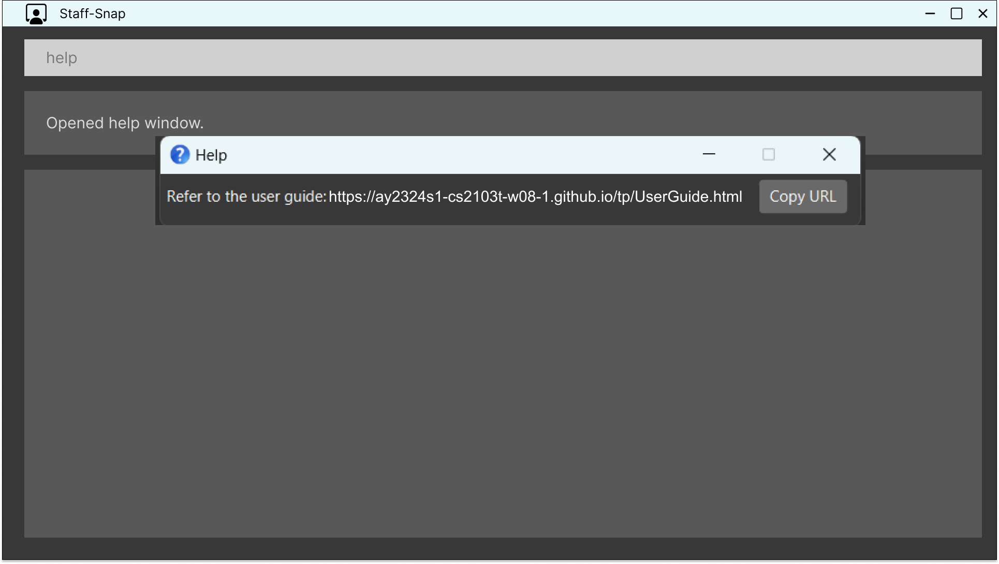

# Staff-Snap User Guide

## User Interface Guide

## Notation Guide
Here are some conventions used in this guide when describing the commands:
Words in `UPPER_CASE` are the parameters to be supplied by the user.
Items in square brackets are optional.
Parameters can be in any order.
Extraneous parameters for commands that do not take in parameters such as `help`, `list`, `clear`, `exit` will be ignored.

## Features
---

### add : Adding a new employee entry

Add a new employee entry to the current list.

Format: `add n/NAME id/IDENTIFIER d/DEPARTMENT j/JOB_TITLE s/SALARY sd/START_DATE f/IS_FULL_TIME`

Example:
`add n/John Doe id/S7891234A d/Marketing j/marketing associate s/1600 sd/2023-09-18 f/true
`

Acceptable values for each parameter:

* `NAME` : non-empty string
* `IDENTIFIER` : string of length 9
* `DEPARTMENT` : must be one of the following strings below.
  * marketing
  * finance
  * operations
  * hr
* `JOB_TITLE` : must be one of the following strings below.
  * hr manager
  * assistant hr manager
  * hr associate
  * head chef
  * sous chef
  * kitchen helper
  * cleaner
  * server
  * restaurant manager
  * assistant restaurant manager
  * accounting manager
  * assistant accounting manager
  * accounting associate
  * marketing manager
  * assistant marketing manager
  * marketing associate
* `SALARY` : non-negative integer value
* `START_DATE` : valid date in the format of YYYY-MM-DD
* `IS_FULL_TIME` : true or false

Expected output when the command succeeds:
* Response Area shows: “Added employee NAME successfully.”
* Working Area shows the updated list of employees

Expected output when the command fails:  
* Incorrect number of parameters: “The number of input parameters is incorrect. The command format should be `add n/NAME id/IDENTIFIER d/DEPARTMENT j/JOB_TITLE s/SALARY sd/START_DATE f/IS_FULL_TIME`.”
* Non-unique identifier: “Invalid value for `IDENTIFIER`. Employee with that identifier already exists.”
* Negative salary: “Invalid value for `SALARY`. Salary value cannot be negative.”
* Invalid identifier : “Invalid value for `IDENTIFIER`. The format should be XXXXXXXXX.”
* Invalid startDate: “Invalid value for `START_DATE`. The format should be YYYY-MM-DD.”
* Invalid isFullTime: “Invalid value for `IS_FULL_TIME`.The value should either be true or false.”
* Invalid department: “Invalid value for `DEPARTMENT`. The value should be marketing/finance/operations/hr.”

UI mockup:

---
### edit : Editing an employee entry

Edit the details of a current employee

Format: `edit i/INDEX [n/NAME] [id/IDENTIFIER] [d/DEPARTMENT] [j/JOB_TITLE] [s/SALARY] [sd/START_DATE] [f/IS_FULL_TIME]`
* Edits the person at the specified `INDEX`. The index refers to the index number shown in the displayed person list.
* At least one of the optional fields must be provided.

Example:
* `edit i/1 s/1500 sd/2023-09-20`

Acceptable value for each parameter:
* `INDEX` : positive integer not larger than the number of employees
* `NAME` : non-empty string
* `IDENTIFIER` : string of length 9
* `DEPARTMENT` : must be one of the following strings below.
  * marketing
  * finance
  * operations
  * hr
* `JOB_TITLE` : must be one of the following strings below.
  * hr manager
  * assistant hr manager
  * hr associate
  * head chef
  * sous chef
  * kitchen helper
  * cleaner
  * server
  * restaurant manager
  * assistant restaurant manager
  * accounting manager
  * assistant accounting manager
  * accounting associate
  * marketing manager
  * assistant marketing manager
  * marketing associate
* `SALARY` : non-negative integer value
* `START_DATE` : valid date in the format of YYYY-MM-DD
* `IS_FULL_TIME` : true or false

Expected output when the command succeeds:
* Response Area shows: “Updated employee NAME details successfully.”
* Working Area shows the updated employee details

Expected output when the command fails:
* Non-unique identifier: “Invalid value for IDENTIFIER. Employee with that identifier already exists.”
* Negative salary: “Invalid value for SALARY. Salary value cannot be negative.”
* Missing index: “Missing INDEX. The command format should be `edit i/INDEX [n/NAME] [id/IDENTIFIER] [d/DEPARTMENT] [j/JOB_TITLE] [s/SALARY] [sd/START_DATE] [f/IS_FULL_TIME]`.”
* Invalid identifier: “Invalid value for IDENTIFIER. The format should be XXXXXXXXX.”
* Invalid startDate: “Invalid value for START_DATE. The format should be YYYY-MM-DD.”
* Invalid isFullTime: “Invalid value for IS_FULL_TIME.The value should either be true or false.”
* Invalid index: “Invalid value for INDEX. The index should be a positive integer not larger than the number of employees.”
* No fields provided: “Please input at least one field to update.”
* Invalid department: “Invalid value for DEPARTMENT. The value should be marketing/finance/operations/hr.”

UI mockup:

---
### list : Listing all employee entries

Displays the full list of all employee entries.

Format: `list`

Examples:
* `list`

Acceptable values for each parameter:
* No parameters required.

Expected output when the command succeeds:
* Response Area shows “Listed all employees.”.
* Working Area shows the full indexed list of employees with their details.
* If the list is empty, Response Area shows “The employee list is empty.”

Expected output when the command fails:
* This command should never fail.

UI mockup:

---
### delete : Deleting an employee entry

Deletes a particular employee entry based on their index number.

Format: `delete i/INDEX`

Examples:
* `delete i/2` deletes the employee with index number 2

Acceptable values for each parameter:
* `INDEX` : positive integer not larger than the number of employees

Expected output when the command succeeds:
* Response Area shows “Deleted employee with index number `INDEX`.”
* Working Area shows the updated list of employees with their details

Expected output when the command fails:
Missing index. “Missing `INDEX`. The command format should be `delete i/INDEX`”
Invalid index: “Invalid `INDEX`. The index should be a positive integer not larger than the number of employees.”

UI mockup:

---
### find : Finding an employee by name

Find employees whose name contains a particular keyword.

Format: `find KEYWORD [MORE_KEYWORDS]`
* The search is case-insensitive, e.g. `LEE` will return both `lee` and `Lee`
* The order of the keywords does not matter. e.g. `Aly Han` will match `Han Aly`
* Only the employee name is searched
* Any person whose name contains the sequence of characters given as the keyword will be given as a result. e.g. `Ed` will match both `Edward` and `Ed`
* Persons matching at least one keyword will be returned (i.e. OR search). e.g. `Hans Bo` will return `Hans Gruber`, `Bo Yang`

Examples:
* `find CARL` finds any employee whose name contains “carl”
* `find CARL YANG` finds any employee whose name contains “carl” or contains “yang”

Acceptable values for each parameter:
* KEYWORD : a string with at least 1 character
* MORE_KEYWORDS : a string with at least 1 character, optional to have, must be preceded by a keyword

Expected output when the command succeeds:
* Response Area shows “Search results for: `KEYWORD [MORE_KEYWORDS]`”
* Working Area shows list of persons matching the name shown
* If no matches are found, Response Area shows “No matches found.”

Expected output when the command fails:
Missing keyword: “Missing `KEYWORD`. Please input a keyword.”

UI mockup:

---
### sort: Sorting employees by descriptor

Sorts the employee list by using a particular descriptor as the sorting criteria.

Format: `sort d/DESCRIPTOR`

Examples:
* `sort name` sorts the list of employees by name alphabetically
* `sort department` sorts the list of employees by department alphabetically
* `sort job_title` sorts the list of employees by job_title alphabetically
* `sort salary` sorts the list of employees by salary in ascending order
* `sort start_date` sorts the list of employees by start date chronologically
* `sort is_full_time` sorts the list of employees by full timers then part timers

Acceptable values for each parameter:
* `DESCRIPTOR` : must be one of the following strings below.
  * name
  * department
  * job_title
  * salary
  * start_date
  * is_full_time

Expected output when the command succeeds:
* Response Area shows success message “List of employees sorted by `DESCRIPTOR`.”
* Working Area shows the list of employees sorted by the descriptor chosen.

Expected output when the command fails:
* Missing descriptor: “Missing `DESCRIPTOR`. Please input a descriptor to sort by.”
* Invalid descriptor: “Invalid value for `DESCRIPTOR`. Please input a valid descriptor from this list: `name / department / job_title / salary / start_date / is_full_time`.”

UI mockup:

---

### filter: Filtering employees by descriptor criteria

Filters the employee list by using a particular descriptor criteria. Returns a list of employees that satisfies the specified criterion.

Format: `filter d/DESCRIPTOR c/CRITERIA`
* DESCRIPTOR: the descriptor of the employee we want to filter by
* CRITERIA: the criteria to apply to the chosen descriptor

There are 3 types of subcommands under the `filter` function. You can filter the list of employees based on a criteria for their `department`, or `job_title`, or `is_full_time`.

Below we provide a more granular description for each subcommand functionality:

---
#### Filtering based on department

Format: `filter d/department c/DEPARTMENT_NAME`

Examples:
* `filter d/department c/marketing` filters to show only employees in the marketing department
* `filter d/department c/operations` filters to show only employees in the operations department

Acceptable value for each parameter:
* `DEPARTMENT_NAME` : must be one of the following strings below.
  * marketing
  * finance
  * operations
  * hr
---

#### Filtering based on job_title

Format: `filter d/job_title c/JOB_TITLE`

Examples:
* `filter d/job_title c/server` filters to show only employees who are servers
* `filter d/job_title c/assistant manager` filters to show only employees who are assistant managers

Acceptable value for each parameter:
* `JOB_TITLE` : must be one of the following strings below.
  * hr manager
  * assistant hr manager
  * hr associate
  * head chef
  * sous chef
  * kitchen helper
  * cleaner
  * server
  * restaurant manager
  * assistant restaurant manager
  * accounting manager
  * assistant accounting manager
  * accounting associate
  * marketing manager
  * assistant marketing manager
  * marketing associate
---

#### Filtering based on is_full_time

Format: `filter d/is_full_time c/IS_FULL_TIME`

Examples:
* `filter d/is_full_time c/true` filters to show only full time employees
* `filter d/is_full_time c/false` filters to show only part time employees

Acceptable value for each parameter:
* `IS_FULL_TIME` : must be one of the following strings below.
  * true
  * false
---

Expected output when the command succeeds:
* Working area shows list of employees filtered by the criteria used
* Response area shows “Employees filtered by DESCRIPTOR CRITERIA”

Expected output when the command fails:
* No descriptor given: “Please input a descriptor to filter by.”
* No criteria given: “Please input a criteria to filter by.”
* Invalid descriptor: “Invalid value for `DESCRIPTOR`. Please input a valid descriptor from this list: `name / department / job_title / salary / start_date / is_full_time`.”
* Invalid criteria: “Invalid value for `CRITERIA`. Please input a valid criteria.”

UI mockup:

---
### Saving the data

Automatically saves the data to a local file whenever there is a change to the employee list

Format: no command required. The data will be automatically saved to a local file every time one of these command is executed:
* `add`
* `edit`
* `delete`

Examples:
* After adding a new employee, the data file is updated
* After deleting an employee, the data file is updated

Acceptable values for each parameter:
* No parameters are required as there is no explicit command needed.

Expected output when the command succeeds:
* There is no output as there is no explicit command to execute.

Expected output when the command fails:
* There is no output as there is no explicit command to execute.

UI mockup:
There is no UI to display for this function.
---
### clear : Purging all employee entries

Clears all the current data stored in the system.

Format: `clear`

Examples:
* `clear`: this command initiates the data clearing process.

Acceptable values for each parameter:
* No parameters required.

Expected output when the command succeeds:
* Response Area shows “All data cleared.”
* Working Area shows empty employee list.

Expected output when the command fails:
* This command should never fail.

UI mockup:

---
### help : Listing all commands

Displays the full list of all possible commands and its functions.

Format: `help`

Example:
* `help`

Acceptable values for each parameter:
* No parameters required.

Expected output when the command succeeds:
* A popup window containing the URL to the user guide will be shown to allow users to navigate to the URL.

Expected output when the command fails:
* This command should never fail.

UI mockup:

---
### exit : Exiting the program

Exits the program.

Format: `exit`

Example:
* `exit`

Acceptable values for each parameter:
* No parameters required.

Expected output when the command succeeds:
* The program closes.

Expected output when the command fails:
This command should never fail.

UI mockup:
There is no UI to display for this command.

