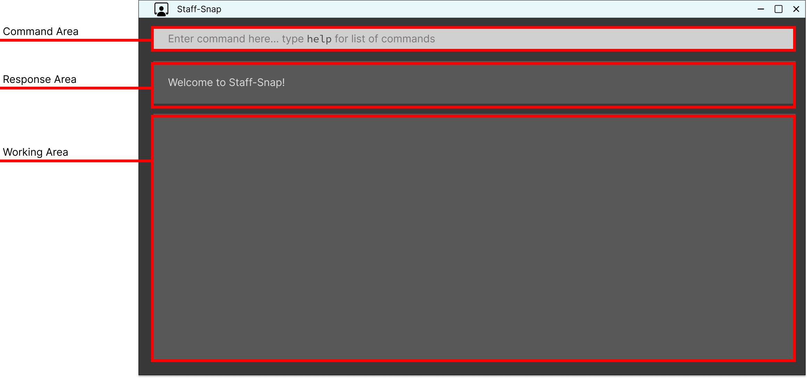
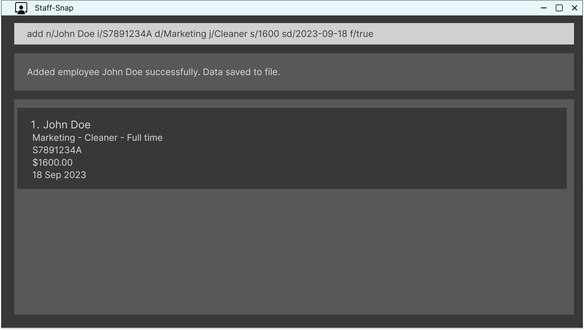
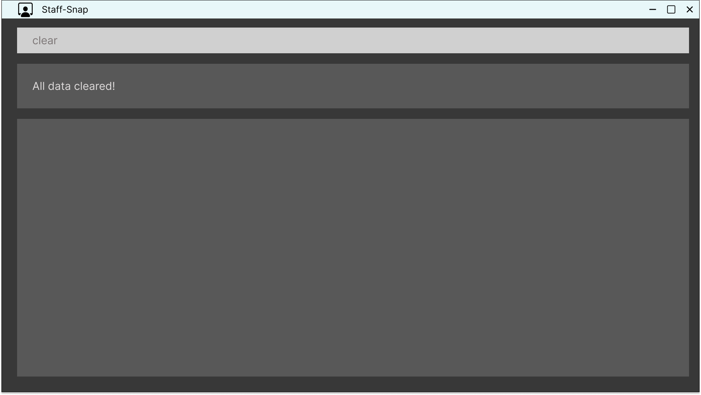

# Staff-Snap User Guide

## User Interface Guide

## Features

<box type="tip" seamless>

**Notation Guide** :rocket: 

* Words in `UPPER_CASE` are the parameters to be supplied by the user.
* Items in square brackets are optional. 
* Parameters can be in any order. 
* Extraneous parameters for commands that do not take in parameters such as `help`, `list`, `clear`, `exit` will be ignored.

</box>

---
### `help` : Viewing help

Displays a message explaining how to access the help page.

Format: `help`

UI mockup:

---
### `add` : Adding a new applicant

Adds a new applicant to the current list.

Format: `add n/NAME hp/PHONE e/EMAIL p/POSITION`

Example:
* `add n/John Doe hp/91234567 e/johndoe@gmail.com p/Software Engineer`
* `add n/Jane Greenwood p/Project Manager e/janeg@yahoo.com hp/91234567`

UI mockup:

---
### `edit` : Editing an applicant

Edits the details of an applicant in the list.

Format: `edit INDEX [n/NAME] [hp/PHONE] [e/EMAIL] [p/POSITION]`
* Edits the person at the specified `INDEX`. The index refers to the index number shown in the displayed person list.
* At least one of the optional fields must be provided.
* Existing values will be updated by the input values.

Example:
* `edit 1 n/Vijay Sankar Kumar` edits the name of the 1st applicant in the list.
* `edit 2 hp/80081234 e/newEmail@hotmail.com` edits the phone number and email of the 2nd applicant in the list.

UI mockup:

---
### `list` : Listing all applicants

Displays the full list of all applicants.

Format: `list`

UI mockup:

---
### `delete` : Deleting an applicant

Deletes a particular applicant based on their index number.

Format: `delete INDEX`
* Deletes the person at the specified `INDEX`.
* The index refers to the index number shown in the displayed applicant list.
* The index **must be a positive integer** 1, 2, 3, ….

Examples:
* `list` followed by `delete 2` deletes the 2nd person in the applicant list.
* `sort d/name` followed by `delete 3` deletes the 3rd person in the sorted applicant list.

UI mockup:

---
### `find` : Finding an applicant by name

Find employees whose name contains a particular keyword.

Format: `find KEYWORD [MORE_KEYWORDS]`
* The search is case-insensitive, e.g. `JOHN` will return both `john` and `John`.
* The order of the keywords does not matter. e.g. `Alice Tan` will match `Tan Alice`.
* Only the applicant name is searched.
* Any person whose name contains the sequence of characters given as the keyword will be given as a result. e.g. `Ed` will match both `Edward` and `Ed`.
* Persons matching at least one keyword will be returned (i.e. OR search). e.g. `Ben Bobby` will return `Ben Yang`, `Bobby Chin`.

Examples:
* `find IVAN` finds any applicant whose name contains “ivan”.
* `find IVAN CHEW` finds any applicant whose name contains “ivan” or contains “chew”.

UI mockup:

---
### `sort`: Sorting applicants by descriptor

Sorts the applicant list by using a particular descriptor as the sorting criteria.

Format: `sort d/DESCRIPTOR`
* `DESCRIPTOR` must be either `name` or `phone`.

Examples:
* `sort d/name` sorts the applicant list by name in alphabetical order.
* `sort d/phone` sorts the applicant list by phone numbers in ascending order.

UI mockup:

---
### `addi` : Adding an interview to an applicant

Adds a new interview to an applicant.

Format: `addi INDEX t/TYPE [r/RATING]`

Examples:
* `addi 1 t/technical r/8.6` adds a Technical interview with rating 8.6 to the 1st person in the displayed applicant list.
* `addi 3 t/screening` adds a Screening interview without rating to the 3rd person in the displayed applicant list.

---
### `editi` : Editing an interview of an applicant

Edits an interview of an applicant.

Format: `editi INDEX i/INTERVIEW_INDEX [t/TYPE] [r/RATING]`
* Edits the person at the specified `INDEX`. The index refers to the index number shown in the displayed person list.
* At least one of the optional fields must be provided.
* Existing values will be updated by the input values.

Examples:
* `editi 1 i/1 t/technical r/7.8` edits the 1st interview of the 1st person in the displayed applicant list to a technical interview with rating 7.8.
* `editi 3 i/2 t/screening` edits the 2nd interview type of the 3rd person in the displayed applicant list to a screening interview.
* `editi 2 i/1 r/8.9` edits the 1st interview rating of the 2nd person in the displayed applicant list to 8.9.

---
### `clear` : Clearing all applicant entries

Clears all the current data stored in the system.

Format: `clear`

UI mockup:

---
### `exit` : Exiting the program

Exits the program.

Format: `exit`

---
### Saving the data

Automatically saves the data to a local storage whenever there is a change to the applicant list. There is no need to save manually.

---
### Editing the data file

<box type="warning" header="**Caution**">
    Editing the data file directly may result in unexpected behaviour.
</box>

Staff-Snap applicant data are saved automatically as a JSON file `[JAR file location]/data/applicantBook.json`. Advanced users are welcome to update data directly by editing that data file.

